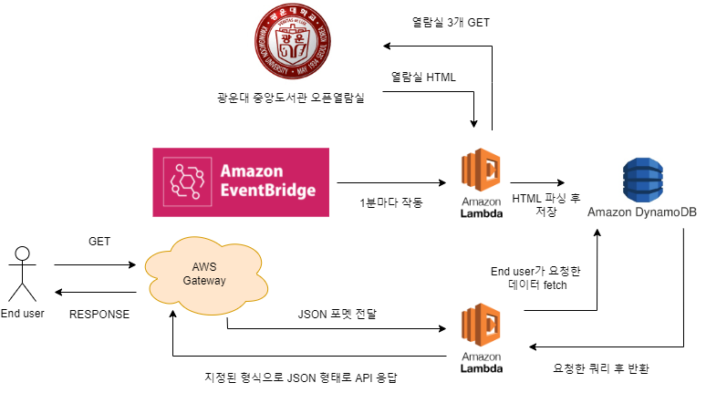

# KWU_reading_room_API

## 사용방법

End Point : https://ujpekm5eqk.execute-api.ap-northeast-2.amazonaws.com/KNET/kwu-reading-room

요구되는 JSON 예: {"room_num" : 1} (열람실 방은 1, 2, 3 중 하나)

```python
# Python 예시
import requests

requests.get(
    "https://ujpekm5eqk.execute-api.ap-northeast-2.amazonaws.com/KNET/kwu-reading-room",
    json = {"room_num" : 1}
)
```

반환되는 결과물 예시

```json
{
    "statusCode": 200, 
    "body": {
        "timestamp": "2021-12-28T13:19:00+00:00", 
        "occupied": [ 1, 2, 3, 4, ...], 
        "vacant": [6, 7, 8, 9, ...], 
        "room_num": 1
    }
}
```

### timestamp : String

UTC 기준 열람실 좌석을 조회한 시간입니다.

실제 정보와 최대 2분 차이가 있을 수 있습니다.

### occupied : Array[int]

사용중인 자리, int인 좌석 번호 Array 입니다.

### vacant : Array[int]

비어있는 자리, int인 좌석 번호 Array 입니다.

### room_num : int

요구한 열람실 방 번호 int 입니다.

---

광운대학교 중앙도서관 오픈열람실 API 입니다



구조는 위와 같이 API 백엔드에서 오픈열람실 HTML을 광운대학교 도서관 사이트에서 가져온 뒤 파싱하여 데이터를 지속적으로 저장하는 형태를 갖추고 있습니다.

1분마다 갱신되는 열람실 정보를 1분 주기로 Amazon EventBridge가 HTML을 가져와서 파싱하는 람다함수를 작동시켜 좌석 번호 데이터를 DynamoDB에 저장합니다.

엔드 유저가 API를 호출할 때 직접 광운대 도서관 홈페이지가 아닌 DynamoDB로부터 데이터를 반환합니다.

---

API 개발 블로그 일지:

[KWU 도서관 오픈열람실 API 만들기 - 1](https://ccppoo.github.io/2021/12/26/KWU-%EC%98%A4%ED%94%88%EC%97%B4%EB%9E%8C%EC%8B%A4-API-%EB%A7%8C%EB%93%A4%EA%B8%B0-1.html)

[KWU 도서관 오픈열람실 API 만들기 - 2](https://ccppoo.github.io/2021/12/26/KWU-%EC%98%A4%ED%94%88%EC%97%B4%EB%9E%8C%EC%8B%A4-API-%EB%A7%8C%EB%93%A4%EA%B8%B0-2%ED%8E%B8.html)

[KWU 도서관 오픈열람실 API 만들기 - 3](https://ccppoo.github.io/2021/12/28/KWU-%EC%98%A4%ED%94%88%EC%97%B4%EB%9E%8C%EC%8B%A4-API-%EB%A7%8C%EB%93%A4%EA%B8%B0-3%ED%8E%B8.html)